[](https://www.python.org/downloads/release/python-3102/)


<p align = "center">
<a href="https://github.com/FranGarcia94">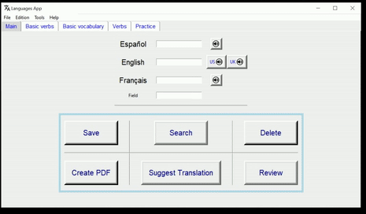</a>
</p>
<p align = "center">
<b>Languages App</b>
</p>

# **Table of contents**   
[Introduction](#introduction)

[Menu](#menu)

[Main Tab](#main-tab)

1. [Save](#save)

2. [Search](#search)

3. [Delete](#delete)

4. [Create PDF](#create-pdf)

5. [Suggest Translation](#suggest-translation)

6. [Review](#review)

[Practice Game](#practice-game)

[Other Tabs](#other-tabs)

[Additional Options](#additional-options)

- [Open Excel](#open-excel)

- [Open PDF](#open-pdf)

- [Dynamic Search](#dynamic-search)

[Shortcuts](#shortcuts)

# Introduction

Some time ago I started learning French and while using the online translators I found on the Internet I wondered what it would be like to program one. That's how the app started, first it was a test of how to use certain python libraries to translate words, then things like saving the words in an excel file, tabs to review vocabulary or new features would be added.

As a good improvised project to which things have been added on the fly, the result is decent for what it represents but certainly not very optimized and redundant in many occasions. However, interesting and certainly to a greater or lesser extent has helped me to get involved with learning a new language.

The interface is oriented to the Spanish, English and French languages, but these could be replaced by any others or more could be added.

Let's see its functions.

# Menu

Within the menu we have different sections:

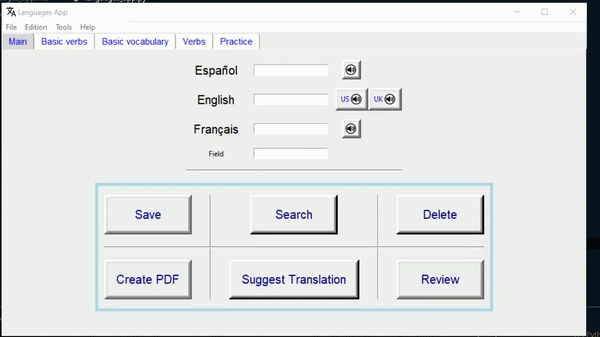

File: 
- open excel
- open pdf
- exit

Edition:
- Clear fields
- Dynamic Search

Tools:
- Light mode
- Dark mode
- Default mode

Help
- License
- About

# Main Tab

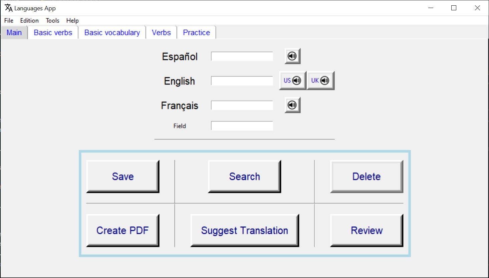

This is the main tab of the application, here we have different functionalities implemented in the form of buttons and 3 text input boxes.

At the top we have the text input boxes but the different languages but we also have 4 audio buttons: one for Spanish and French and two for English.

These buttons are used to reproduce by audio the word that is in the box. In the case of the English language we have British accent and American accent.

In order to implement these functions we need to have downloaded the language packs for these languages. In addition we have to check in which order they are arranged in our system.

Here is a small code to better understand this library:

```python
import pyttsx3
engine = pyttsx3.init()
a=[]
for voice in engine.getProperty('voices'):
    a.append(voice.id)
    #print(a)
    #print('\n')

    print(voice.name)
    #print(voice.id)
    #print(voice.languages)
engine.setProperty('voice', a[1])

engine.say("hola mundo")
engine.runAndWait()
```

```python
# Output
Microsoft Helena Desktop - Spanish (Spain)
Microsoft Zira Desktop - English (United States)
Microsoft Hazel Desktop - English (Great Britain)
Microsoft Hortense Desktop - French (France)
```

´pyttsx´ is the library needed to convert text to speech.
1º we create an engine with the ´init´ constructor to start the library.
2º With the loop what we get is to get the features of the library but related to our device,
in this case I had only the spanish and english language and going to 'languages' in the windows search engine I installed the french language.

3º The list ´a´ collects the 3 languages in the form of id being:
- a[0] - Spanish
- a[1] - English USA
- a[2] - English UK
- a[3] - French

With `engine.setProperty()` we change the language.
The rest is to reproduce the audio.

## Save

The application has an associated '.xlsx' file, in my case named 'lang2'. This file is divided in 4 sheets named a, b, c and d, each one for a specific function. The main one will be the sheet a where the words or phrases inserted in the app will be saved, the rest of the tabs are optional and we will see them later.

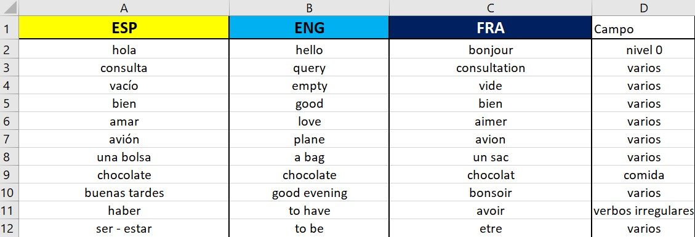

As we can see in the image, the sheet is divided in 4 columns that coincide with the entry boxes of the interface.

Returning to the interface, the 'Save' button saves in the excel sheet the words found in the text boxes, each one in its corresponding column. If any of the text boxes is blank, it will be automatically named as 'none' in the text sheet, also it is necessary to always insert a word in the Spanish language since this is the base language from which I started and this way I was sure to fill it whenever I inserted a new word.

It is also implemented that all words are saved in lowercase to facilitate other functionalities and that only a certain number of characters can be inserted, in this case 20 has been set as a limit but this can be changed in the following lines of code:

```python
def check_s(entry_widget):

            def bind_entry(event):# limita los caracteres que puedo escribir

                    if len(entry_widget.get()) > 20:

                            #entry_widget['state'] = 'disabled'
                            entry_widget.delete(len(entry_widget.get()) - 1)

            entry_widget.bind("<KeyRelease>",bind_entry)
```

Note: If you press save and the word is already saved in excel, the program will launch a warning message informing you of this situation and proposing 3 options:
- New meaning: A new entry is saved with the variant meaning.
- Rename: The field is renamed.
- Cancel: The operation is cancelled.

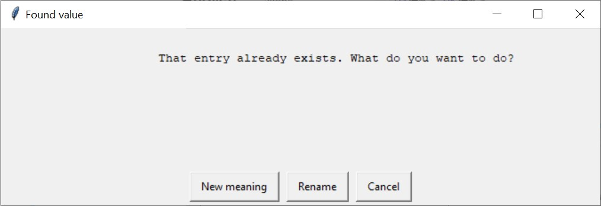

## Search

This function allows to search if a word is saved in the database that, in this case, would be the excel sheet.

If a match is found, it will return the fields associated with that word for the other fields, if it is not found it will return an information message.

To use this function you need to type a single language field, if you fill in more it will skip an error message:

If all fields are blank, this error message will jump:

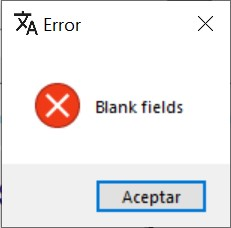

This function initially looks for exact matches for example if you type in the Spanish language the word ´hello´, it will look for that exact word in the database and if it finds it will return its translations. In the event that the exact match is not found, it will be searched if there is any phrase where the word appears isolated for example ´hello, how are you?´. This works for all languages.

However, in this case there may be several coincidences, in the previous case also but here more likely. In that case, all the options found will appear in the terminal. In a future code update this will be corrected so that all matches appear in a separate tab.

## Delete

This function deletes an entry from the excel sheet, making it unavailable. To do this, it is advisable to access an entry through the 'Search' button, because in order to delete correctly the fields must match an entry in the database.

Also, before performing the deletion a new warning window will appear asking if you are sure to delete that entry.

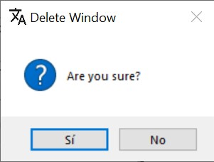

## Create PDF

This function automatically creates a ´pdf´ file where 3 columns are displayed, each corresponding to a language. 

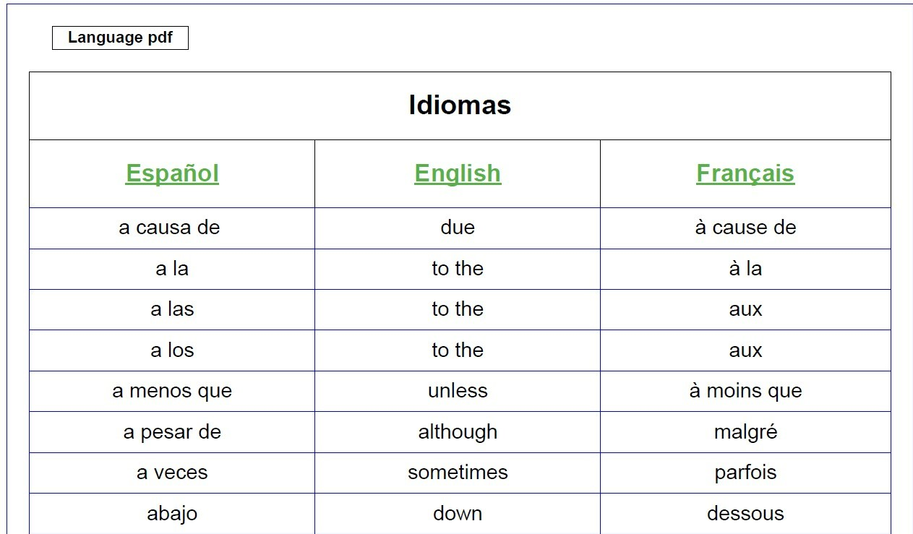

Here the words in the database are sorted in alphabetical order and separated in cells.

The file is automatically named ´Idiomas_.pdf´ and saved in the folder where you have the program.

## Suggest Translation

As the name suggests, this function suggests a translation. Thanks to the googletrans python library we can translate words or phrases automatically.

To use it, just type a word in one of the language fields and press the button and the remaining fields will be filled with the translation of the word.

If we press the button and there is more than one field written, it will throw an error message.

## Review

As we have seen in the introduction of this tab, we have several buttons to play audio and listen to the pronunciation of the words in the different fields.

With this function all the words saved in the three languages, in order, Spanish, English and French, will be reviewed by audio.

This function is designed to review the saved words, so that when you play the word in Spanish, there is a period of time in which you can think what is the translation in the other languages.

# Practice Game

This is a tab created to practice playing, in this case we have chosen the hangman game because it is simple and ideal for practicing new words.

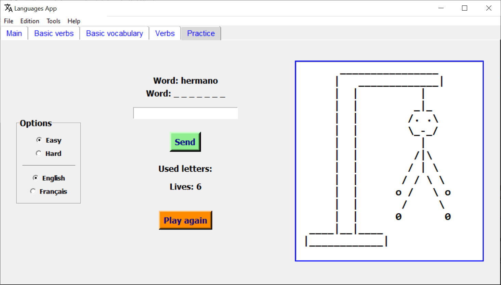

We can choose to play in easy or hard mode:

In easy mode the word is shown in the fixed language which in this case is Spanish and we try to "guess" the translation in English or French.

The difficult mode is the same but the word to be translated is not shown but the user must guess it. This is truly the hangman game.

You can insert letter by letter or the whole word. After each insertion the word will appear in used letters.

In addition, the animation of the box will change according to the number of lives the user has, starting with 6 lives, having an extra animation for victory and another one for defeat.

||||
|---|---|---|
|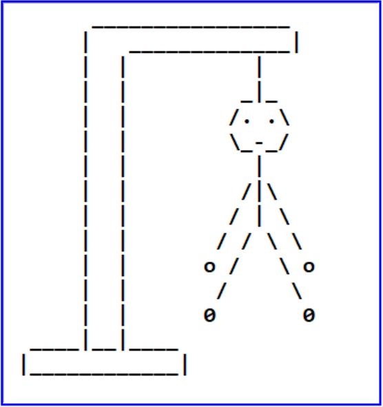|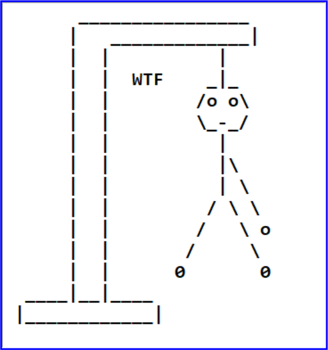|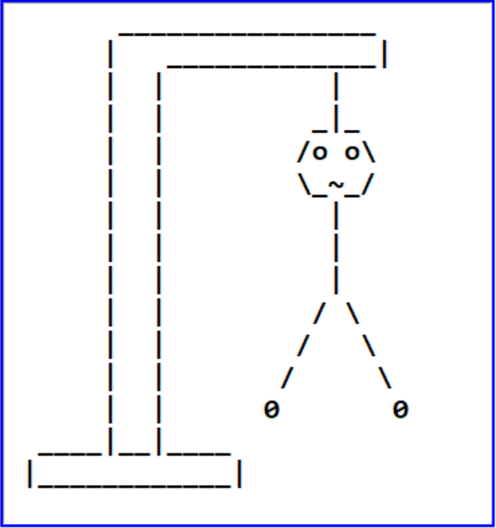|
|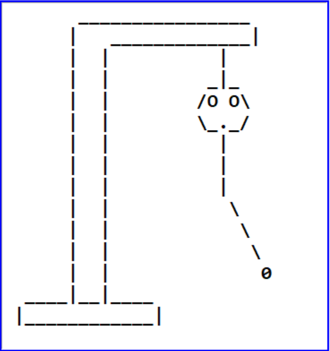|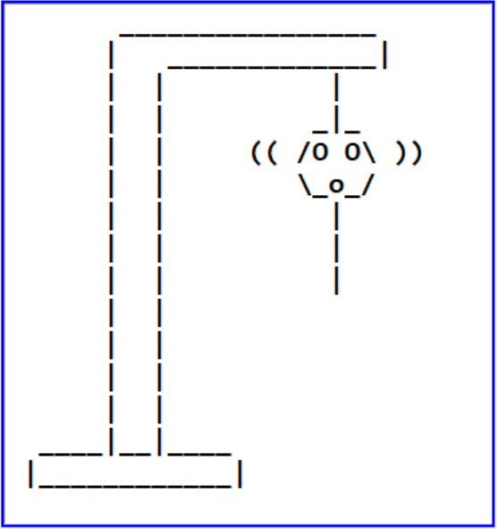||

|Game Over|Winner|
|---|---|
|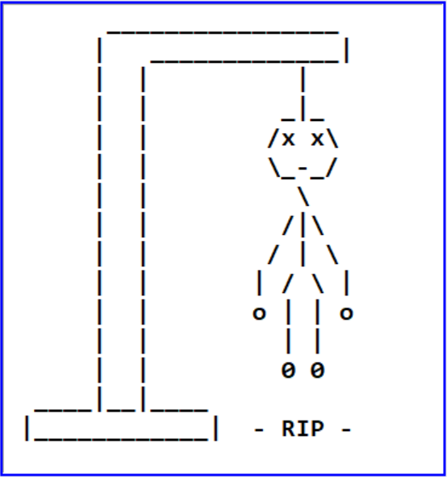|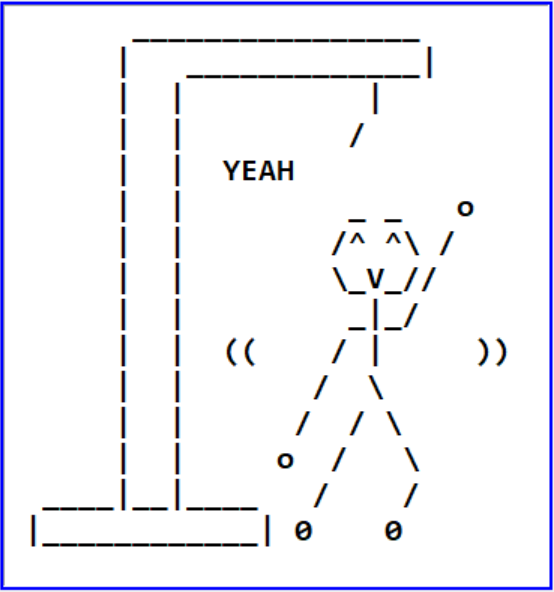|

# Other tabs

You can create as many tabs as you want, in this case I have inserted three tabs whose names are: Basic Verbs, Basic Vocabulary and Verbs.

To all these tabs an audio play button is automatically added by columns to review the content and a colored box is also automatically assigned depending on the hierarchy of the tab's organization.

As I say, here you can add as many tabs as you want and in any format. In my case, new tabs can be added automatically if they respect the preset model as follows:

```python
enter_tab(mf3, 'Basic Verbs', 'b')
```

Indicating the frame where you want to add it, the title and the excel sheet to be read.

# Additional options

- ### Open Excel

Open the associated excel file.

- ### Open PDF

Open the associated PDF file.

- ### Dynamic search

The search via the search button is useful for searching for a specific word, but here it makes sense to sort the entries with a field.


Accessing the dynamic search allows us to search for words sorted by language and by search field (Adjectives, Verbs, Simple Phrases, Sports, Family, etc.).

We can access the dynamic search through ctrl + B or through menu -> edit -> Dynamic search.

It will open a tab where we can perform the search in a simple way, it also has an audio playback button to enhance the experience.

# Shortcuts

To facilitate the use of the interface, the following shortcuts have been enabled:

- Ctrl + J : Clear the fields
- Ctrl + P : Open the PDF file
- Ctrl + E : Open the Excel file
- Ctrl + L : Light mode
- Ctrl + O : Dark mode
- Ctrl + D : Default mode
- Ctrl + B : Dynamic search

